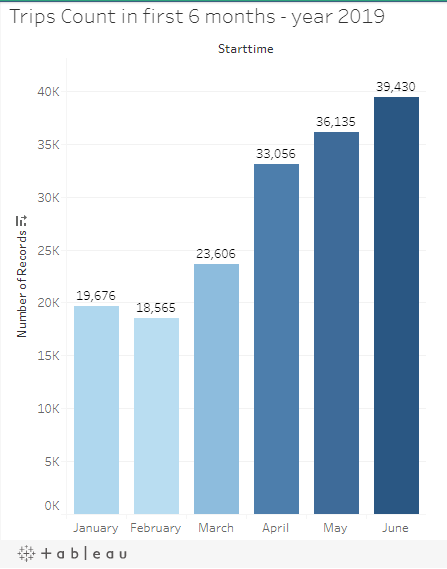
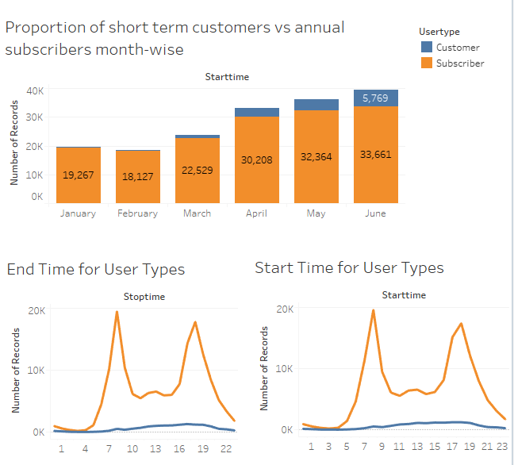
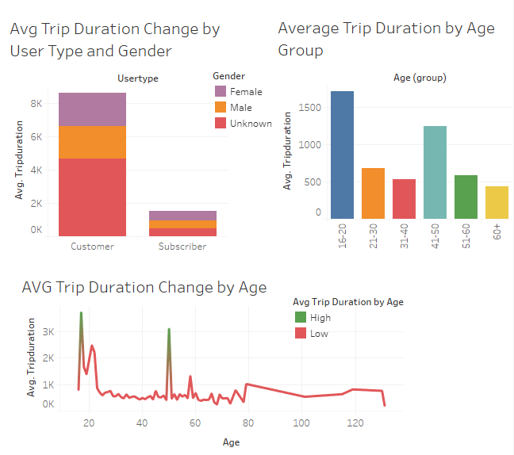
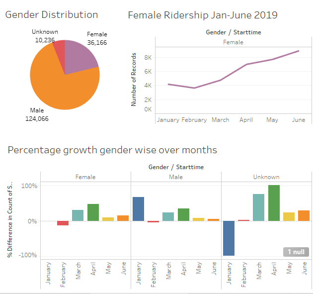
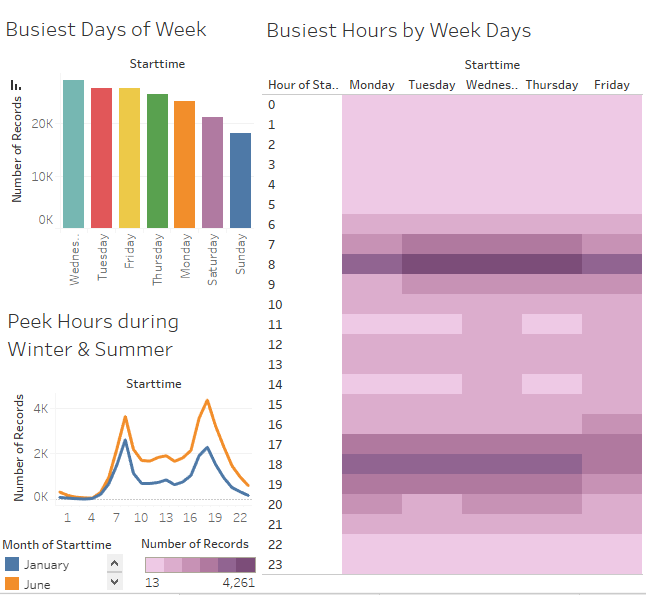
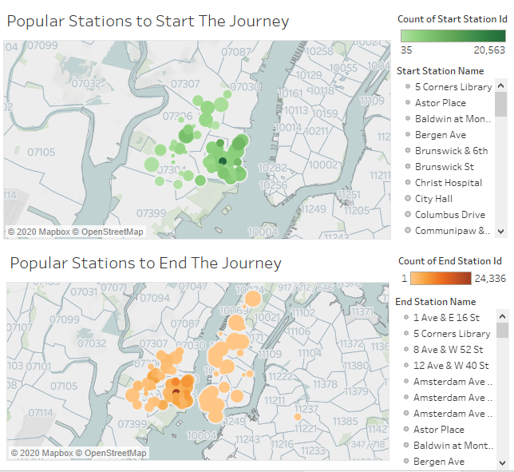
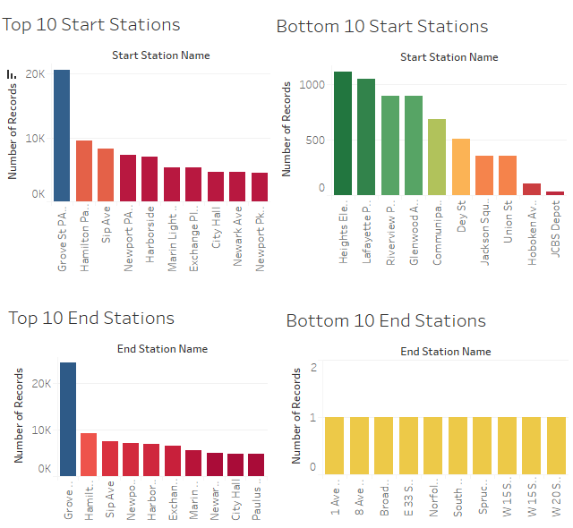
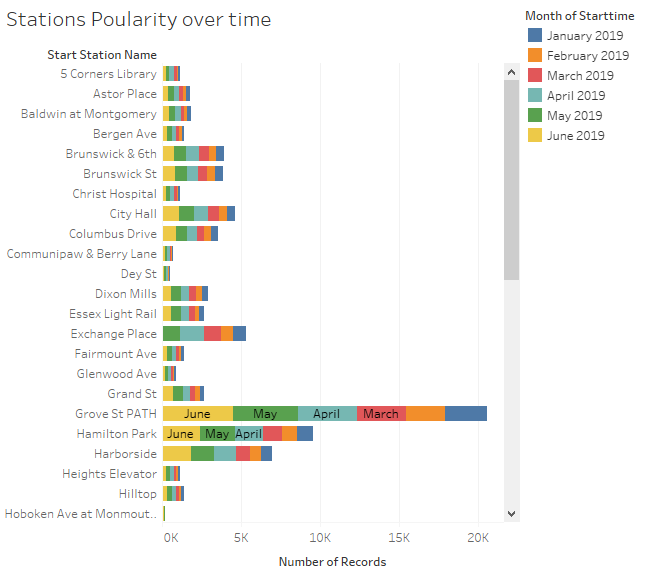
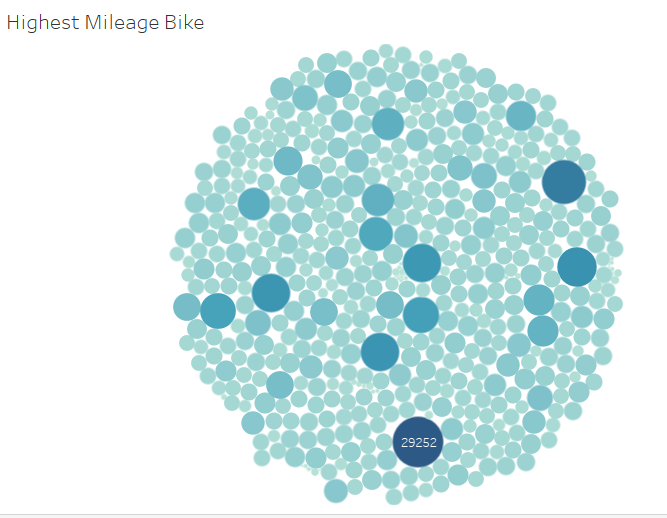

# Tableau-Challenge - Citi Bike Analytics

## Data Source
https://www.citibikenyc.com/system-data

## Questions-
- How many trips have been recorded total during the chosen period?
- By what percentage has total ridership grown?
- How has the proportion of short-term customers and annual subscribers changed?
- What are the peak hours in which bikes are used during summer months?
- What are the peak hours in which bikes are used during winter months?
- Today, what are the top 10 stations in the city for starting a journey? 
- Today, what are the top 10 stations in the city for ending a journey? 
- Today, what are the bottom 10 stations in the city for starting a journey? 
- Today, what are the bottom 10 stations in the city for ending a journey 
- Today, what is the gender breakdown of active participants (Male v. Female)?
- How effective has gender outreach been in increasing female ridership over the timespan?
- How does the average trip duration change by age?
- What is the average distance in miles that a bike is ridden?
- Which bikes (by ID) are most likely due for repair or inspection in the timespan?
- How variable is the utilization by bike ID?

## Skills Used:
Tableau, Python, Jupyter Notebook

## Summary Findings:

-----

- Citi Bike Users are mostly annual subscribers and travel mostly between 7 to 9 am and 5 to 7 pm on weekdays, which is obvious as they travel to/from their jobs. On the other hand, customers mostly travel on weekends and their travel peek times are between 12 pm and 6 pm.

-----

- Average Trip Duration is higher in one-time Customers as they are tourists who travel more distance as compared to annual subscribers who travel shorter distance to their offices/schools. Citi Bike Users are mostly youngers between age 16-20 and mid-age people between 41-50.

-----

-----

-----

- Summer is the busiest time of the year and Wednesday, Tuesday are the most busiest days of the week followed by Friday, Thursday, Saturday and Sunday.

-----

- Popular stations to start a journey are mostly located near Jersey City area whereas popular end stations are located both in Jersey city and Manhatten-New York City.

-----

-----

-----

-----

### Webste Link:
https://public.tableau.com/profile/minu6484#!/vizhome/TableauChallenge_15790394017170/Story-CitiBikesAnalysis
