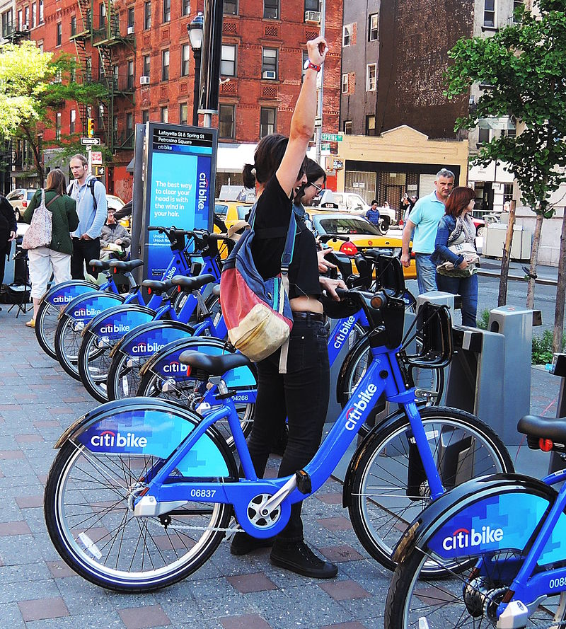

# Tableau-Challenge - Citi Bike Analytics

## Data Source
https://www.citibikenyc.com/system-data

## Questions-
- How many trips have been recorded total during the chosen period?
- By what percentage has total ridership grown?
- How has the proportion of short-term customers and annual subscribers changed?
- What are the peak hours in which bikes are used during summer months?
- What are the peak hours in which bikes are used during winter months?
- Today, what are the top 10 stations in the city for starting a journey? 
- Today, what are the top 10 stations in the city for ending a journey? 
- Today, what are the bottom 10 stations in the city for starting a journey? 
- Today, what are the bottom 10 stations in the city for ending a journey 
- Today, what is the gender breakdown of active participants (Male v. Female)?
- How effective has gender outreach been in increasing female ridership over the timespan?
- How does the average trip duration change by age?
- What is the average distance in miles that a bike is ridden?
- Which bikes (by ID) are most likely due for repair or inspection in the timespan?
- How variable is the utilization by bike ID?

## Skills Used:
Tableau, Python, Jupyter Notebook

## Summary Findings:

